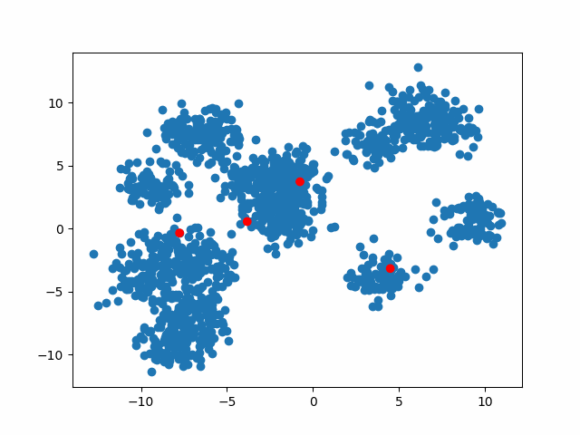

# KMeans-animation

Simple matplotlib animations to visualize KMeans clustering iterations. Customizable dataset and centroid initialization.

Some examples:

It's also possible to change the length and the speed of the animation by setting 'frames' and 'fps' parameters.

Slower(fps = 1,frames=5)                     |  Faster(fps=10,frames=5)
:-------------------------:|:-------------------------:
 |  

